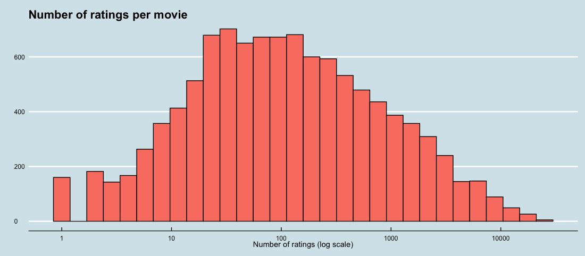
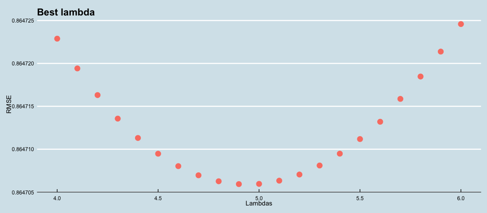

```{r setup, include=FALSE}
library(tidyverse)
library(ggthemes)
library(gridExtra)
library(knitr)
library(kableExtra)
knitr::opts_chunk$set(echo = TRUE)
#loads the files and creates some variables used in the report text
edx <- as.data.frame(read_csv('data/edx.csv'))
validation <- as.data.frame(read_csv('data/validation.csv'))
valid <- as.data.frame(read_csv('data/valid.csv'))
pred <- as.data.frame(read_csv('data/pred.csv'))
test_set <- as.data.frame(read_csv('data/test-set.csv'))
new_train <- as.data.frame(read_csv('data/new-train.csv'))
train_set <- new_train
#colors for plots
color1 <- "#FA8072"
color2 <- "#FFE0E0"
color3 <- "#A52A2A"
```

\newpage

# 1 Executive Summary

This project is about a movie recommendation system developed based on the ratings previously given by users. This type of system is very common in machine learning algorithms and is widely used in companies with a large database of products and customers who are encouraged to register their ratings.

The goal here is to train a machine learning algorithm that provides user ratings, between `r min(edx$rating)` and `r max(edx$rating)` stars.

The value used to evaluate the performance of the algorithm is Root Mean Square Error (RMSE). 

>#### RMSE
>
It is a measure of accuracy for comparing forecasting errors from different models for a given dataset. In this case, it is the typical mistake we make when predicting a movie rating. 

If it is greater than 1, our typical error is greater than a star, which is not a good thing. We define $y_{u,i}$ as the rating for movie $i$ by user $u$ and denote our prediction with $\hat{y}_{u,i}$. The RMSE is then defined as:

$$ RMSE = \sqrt{\frac{1}{N}\sum_{i=1}^{N}(\hat{y}_i - y_i)^2} $$

The RMSE resulting from this algorithm must be less than
0.8649.

For this project was used the database made available by the team through the link 

http://files.grouplens.org/datasets/movielens/ml-10m.zip, 

which was divided into edx (training set) and validation (test set used only for final model validation). The dataset could also be downloaded separately:

https://www.dropbox.com/s/nspymeso8rmmak1/edx.rds?dl=1  
https://www.dropbox.com/s/x0s477b0kzxpl6i/validation.rds?dl=1

It contains six variables: `r colnames(edx)[1:5]` and `r colnames(edx)[6]`. Each line represents a single user rating for a single movie with a total of `r format(nrow(edx), big.mark = ",")` observations, `r format(n_distinct(edx$userId), big.mark = ",")` unique users and `r format(n_distinct(edx$movieId), big.mark = ",")` different movies. The validation set represents 10% of the 10m MovieLens dataset with a total of `r format(nrow(validation), big.mark = ",")` occurrences. 

To develop the algorithm and define the parameters that minimize the RMSE, cross validation was used, so edx was divided into train_set, with `r format(nrow(train_set), big.mark = ",")`, and test_set, with `r format(nrow(test_set), big.mark = ",")` observations (20% of edx).

The model considered an overall average of ratings and the bias of each user, movie and genre. The year movies were released and rated were also considered. In addition, a penalty was given to avoid outliers effects of movies with few rates and regressions were used to predict residuals with a smaller data set. After all, the average of chosen techniques was used for the final prediction.

\newpage

# 2 Methods and Analysis


```{r rating count, include=FALSE}
nr <- edx %>% group_by(rating) %>% summarise(N = n()) %>% arrange(desc(N))
```
Observing the general distribution of ratings, we notice the grades `r nr[1,1]`, `r nr[2,1]` and `r nr[3,1]` are the most common. We also notice that evaluations with a half star are unusual when compared to whole stars, only `r round(mean(edx$rating == 0.5 | edx$rating == 1.5 | edx$rating == 2.5 | edx$rating == 3.5 | edx$rating == 4.5)*100, 2)`%.
  
    
```{r rating-distribution, echo = FALSE, results = "hide", fig.align='center'}
#make the plot  
#edx %>% mutate(star = ifelse((rating == 1|rating == 2|rating == 3|rating == 4|rating == 5), "w", "h")) %>% 
#    ggplot (aes (rating, fill = star)) + geom_histogram (bins = 30, color = "black") + 
#    theme_economist () + xlab ("Rating") + ylab ("") + ggtitle ("Rating distribution") +
#    scale_x_continuous(breaks=seq(0, 5, by = 0.5)) + scale_fill_manual(values = c("w" = color1, "h" = color2)) +
#    theme (axis.text.x = element_text (size = 9), axis.text.y = element_text (size = 9)) + guides(fill=FALSE)
```
  
```{r, echo = FALSE, fig.align='center'}
#show saved plot

```
  

```{r RMSE & mu, include=FALSE}
RMSE <- function(true_ratings, predicted_ratings){sqrt(mean((true_ratings - predicted_ratings)^2))}
mu <- mean(edx$rating)
```
The overall ratings is `r round(mu, 2)` and, if we use it as a single prediction we will have an RMSE = `r RMSE(test_set$rating, mu)`

The first step was to centralize the rating column by subtracting the average ($\mu$), then finding the variables that could explain the residual.


## 2.1 Movie effect


Looking at the data we notice some movies are better rated than others and residual follows a distribution close to normal. This seems natural, since some productions and scripts are better than others.

```{r movies variables, include=FALSE}
#mr <- train_set %>% group_by (movieId) %>% summarize (rating = mean (rating)) #movies rating
nm <- train_set %>% group_by(movieId) %>% summarise(N = n()) #movies rating count
big_N <- nm %>% arrange(desc(N))
```

```{r centralized movie mean rating, echo = FALSE, results = "hide", fig.align='center'}
#make the plot
#mr %>% ggplot (aes (rating-mu)) + 
#  geom_histogram (bins = 30, color = "black", fill = color1) + 
#  theme_economist () + xlab ("Centralized movie mean rating") + ylab ("") + 
#  ggtitle ("Movie mean rating distribution") + 
#  theme (axis.text.x = element_text (size = 9), axis.text.y = element_text (size = 9))
```

```{r, echo = FALSE, fig.align='center'}
#show saved plot

```

To improve the model, we add each movie bias ($b_i$), which is its average residual. 

At the train set movies have an average of `r round(mean(nm$N))` reviews. While some movies have more than `r format(round(big_N[9,2]/10000)*10000, big.mark = ",")` reviews, `r nrow(nm %>% filter(N == 1))` have only one.

```{r number of ratings per movie, echo = FALSE, results = "hide", fig.align='center'}
#make the plot
#nm %>% ggplot(aes(N)) + geom_histogram(bins = 30, color = "black", fill = color1) + 
#  scale_x_log10() + theme_economist() + xlab("Number of ratings (log scale)") + 
#  ylab("") + ggtitle("Number of ratings per movie") + 
#  theme(axis.text.x = element_text(size = 9), axis.text.y = element_text(size = 9))
```

```{r, echo = FALSE, fig.align='center'}
#show saved plot

```

It is very risky to say a title has an average rating of 5 stars based on only one user opinion, so we had to penalize movies with few ratings and this was made by regularization.


>#### Regularization
>
The process basically consists of adding a constant ($\lambda$) to each movie number of observations ($n_i$) when calculating the average. If $n_i$ is large $\lambda$ has no effect, since $n_i + \lambda \approx n_i$. On the other hand, if $n_i$ is small $b_i$ tends to 0 and will be calculated with the following equation:

$$ b_i = \frac{1}{\lambda + n_i} \sum_{u=1}^{n_i}(Y_{u,i} - \mu) $$

And our forecast is taken with:

$$\hat{y} = \hat{\mu} + \hat{b}_i$$
and

$$Y_{u,i} = \mu + b_i + \varepsilon_{u,i}$$

Where $\varepsilon_{u,i}$ is the error for user $u$ and movie $i$ with a zero average. The values less than `r min(edx$rating)` and greater than `r max(edx$rating)` were brought into the margin, improving the results.

The RMSE obtained now is `r RMSE(test_set$rating, mu + pred$b_i)`, better than the previous one.

## 2.2 User effect

Users also have their own bias. Some tend to give good grades always, while others tend to give below average rates.

```{r users bias distribution, echo = FALSE, results = "hide", fig.align='center'}
#make the plot
#new_train %>% ggplot(aes(b_u)) + geom_histogram(bins = 30, color = "black", fill = color1) + 
#  theme_economist() + xlab("Users bias") + ylab("") + 
#  ggtitle("Users bias distribution") + 
#  theme(axis.text.x = element_text(size = 9), axis.text.y = element_text(size = 9))
```
   
```{r, echo = FALSE, fig.align='center'}
#show saved plot

```

Was also added the user effect, represented by $b_u$ and, as some users rated very few movies, which makes estimating the bias unreliable,   

```{r user rating count, include=FALSE}
nu <- train_set %>% group_by(userId) %>% summarise(N = n())
# make prediction with movie & user effects
bi_bu <- pred %>% mutate(y_hat = mu + ifelse(is.na(b_i), 0, b_i) + ifelse(is.na(b_u), 0, b_u))  %>% 
  mutate(y_hat = ifelse(y_hat <= 0.5, 0.5, ifelse(y_hat >= 5, 5, y_hat)))
```

```{r number of ratings per user, echo = FALSE, results = "hide", fig.align='center'}
#make plot
#nu %>% ggplot(aes(N)) + 
#  geom_histogram(bins = 30, color = "black", fill = color1) + 
#  scale_x_log10() + theme_economist() + xlab("Number of ratings (log scale)") + 
#  ylab("") + ggtitle("Number of ratings per user") + 
#  theme(axis.text.x = element_text(size = 9), axis.text.y = element_text(size = 9))
```
   
```{r, echo = FALSE, fig.align='center'}
#show saved plot

```

we have to use regularization.

$$b_u = \frac{1}{\lambda + n_i} \sum^{n_i}_{u=1} (Y_{u,i} - \mu - b_i)$$

$$Y_{u,i} = \mu + b_i + b_u + \varepsilon_{u,i}$$

Now the RMSE is `r RMSE(test_set$rating, bi_bu$y_hat)`. The values less `r min(edx$rating)` and greater than `r max(edx$rating)` were brought into the range.

## 2.3 Genre effect

```{r principal genres count, include=FALSE}
ng <- train_set %>% separate_rows(genres, sep = "\\|") %>% group_by(genres) %>% summarise(N = n()) %>% arrange(desc(N))
```

At edx we have `r nrow(ng)` classifications for genres and some are much more evaluated than others. `r ng[1,1]` and `r ng[2,1]` are rated more than `r (round(ng[2,2]/ng[18,2]/10)-1)*10` times compared to `r ng[18,1]`, for example.

```{r principal genres distribution, echo = FALSE, results = "hide", fig.align='center'}
#make plot
#train_set %>% separate_rows(genres, sep = "\\|") %>% group_by(genres) %>%
#  summarise(N = n()) %>% mutate(genres = reorder(genres, desc(N))) %>% 
#  ggplot(aes(genres, N)) + geom_bar(stat="identity", color = "black", aes(fill = genres)) + 
#  theme_economist() + xlab("Genres") + ylab("") + ggtitle("Principal genres distribution") + 
#  theme(axis.text.x = element_text(angle = 90, hjust = 1, size = 9), axis.text.y = element_text(size = 9)) +
#  guides(fill=FALSE)
```

```{r, echo = FALSE, fig.align='center'}
#show saved plot

```

Most movies do not have one, but some of those principal genres. Thinking of each combination as a specific genre we now have `r n_distinct(edx$genres)` categories. Let's look at the most popular genres to better understand how the data is distributed.

```{r genres rating error, echo = FALSE, results = "hide", fig.align='center'}
#g_ratings <- train_set %>% group_by(genres) %>% summarise(N = n(), rating = rating, avg = mean(rating), sd = sd(rating)) %>% filter(N >= 100000) %>% mutate(genres = reorder(genres, desc(N))) #genres rating count
#g_ratings2 <- g_ratings %>% group_by(genres) %>% summarise(N = N[1], avg = avg[1], sd = sd[1]) #genres ratin error
#make plot
#p1 <- g_ratings %>% ggplot(aes(genres, rating, fill = genres)) + geom_boxplot() + 
#  geom_point(aes(genres, avg)) + theme_economist() + theme(axis.text.x = element_text(angle = 90, hjust = 1, size = 9), axis.text.y = element_text(size = 9)) + xlab("") + ylab("") + ggtitle("Genres ratings") + guides(fill=FALSE)
#p2 <- g_ratings2 %>% ggplot(aes(genres, avg, ymin = avg - sd, ymax = avg + sd)) + geom_point(color = "black") + geom_errorbar(aes(color = genres)) + theme_economist() + theme(axis.text.x = element_text(angle = 90, hjust = 1, size = 9), axis.text.y = element_text(size = 0), legend.position = "none") + xlab("") + ylab("") + ylim(0.5, 5) + ggtitle("Genres error (1SD)")
#grid.arrange(p1, p2, ncol = 2)
```   

```{r, echo = FALSE, fig.align='center'}
#show saved plot

```

A distribution of genres ratings analysis, show us the values are accumulated around the average. We also notice that, after subtracting movie and user bias, the genre bias scope is very narrow.

```{r ratings per genre distribution, echo = FALSE, results = "hide", fig.align='center'}
#make plot
#p3 <- train_set %>% group_by(gen_ind) %>% summarise(rating = mean(rating)) %>% ggplot(aes(rating)) + geom_histogram(bins = 30, color = "black", fill = color1) + theme_economist() + xlab("Rating") + ylab("") + ggtitle("Ratings per genre distribution") + theme(axis.text.x = element_text(size = 9), axis.text.y = element_text(size = 9))
#p4 <- new_train %>% ggplot(aes(b_g)) + geom_histogram(bins = 30, color = "black", fill = color1) + theme_economist() + xlab("Genres bias") + ylab("") + ggtitle("Genres bias distribution")
#p5 <- train_set %>% group_by(genres) %>% summarise(N = n()) %>% ggplot(aes(N)) + geom_histogram(bins = 30, color = "black", fill = color1) + scale_x_log10() + theme_economist() + xlab("Number of ratings (log scale)") + ylab("") + ggtitle("Number of ratings per genre") + theme(axis.text.x = element_text(size = 9), axis.text.y = element_text(size = 9))
#grid.arrange(p3, p4, p5, ncol = 3)
```    

```{r, echo = FALSE, fig.align='center'}
#show saved plot

```

```{r genres combination count, include=FALSE}
gc <- train_set %>% group_by(genres) %>% summarise(N = n())
```

There are genres with only one evaluation and others with more than `r round(max(gc[,2])/100000-1)*100` thousand grades, so we must use regularization.

$$b_g = \frac{1}{\lambda + n_i} \sum^{n_i}_{u=1} (Y_{u,i} - \mu - b_i - b_u)$$

$$Y_{u,i} = \mu + b_i + b_u + b_g + \varepsilon_{u,i}$$

```{r bi+bu+bg prediction, include=FALSE}
# make prediction with movie, user and genre effects
bi_bu_bg <- pred %>% mutate(y_hat = mu + ifelse(is.na(b_i), 0, b_i) + ifelse(is.na(b_u), 0, b_u) + ifelse(is.na(b_g), 0, b_g))  %>% mutate(y_hat = ifelse(y_hat <= 0.5, 0.5, ifelse(y_hat >= 5, 5, y_hat)))
```

Now we have reached an RMSE equal to `r RMSE(test_set$rating, bi_bu_bg$y_hat)`, which is already lower than the target, 0.8649.

\newpage

## 2.4 Time effect

Next to the movie's title, in edx, we have the release year. This data was separated into a new column and thus we gained another variable called “year”. From the variable “timestamp”, which represents the date of the evaluation with hours, minutes and seconds, only the year was separated into a new variable “r_date”.

### 2.4.1 Release date

We can see a strong influence of the release year on the movie grades. It is clear the older the movie, higher its score tends to be. But why? Movies released between 1930 and 1970 are classics, have already undergone the filter of time and if they are still popular after, it is because they are probably good. In the 80’s it is possible to notice a sharp drop in grades, having the worst phase in the 90’s, which is an important decade because they are the most evaluated movies. Analyzing the release year bias, we note that the effect is softened after the other biases have been removed, but still relevant, especially in the 90’s where we noticed a deep depression. The most recent releases have slightly better ratings and it makes an important difference for year bias.

```{r year ratings and bias, echo = FALSE, results = "hide", fig.align='center'}
#make the plot
#ratings per year
#p6 <- train_set %>% filter(year >= 1930) %>% group_by(year) %>% summarize(rating = mean(rating), Count = n()) %>% ggplot(aes(year, rating)) + geom_point(aes(size = Count), color = color1) + geom_smooth(color = color3, span = 0.3) + theme_economist() + xlab("") + ylab("") + ggtitle("Ratings per year") + theme(axis.text.x = element_text(size = 9), axis.text.y = element_text(size = 9), legend.position = "none") + scale_x_continuous(breaks=seq(1930, 2010, by = 10)) + guides(fill=FALSE)
#year bias
#p7 <- new_train %>% filter(year >= 1930) %>% group_by(year) %>% summarize(b_y = mean(rating-mu-b_i-b_u-b_g), Count = n()) %>% ggplot(aes(year, b_y)) + geom_point(aes(size = Count), color = color1) + geom_smooth(color = color3, span = 0.3, family="symmetric") + theme_economist() + xlab("") + theme(axis.text.x = element_text(size = 9), axis.text.y = element_text(size = 9)) + scale_x_continuous(breaks=seq(1930, 2010, by = 10))
#grid.arrange(p6, p7, ncol = 2)
```

```{r, echo = FALSE, fig.align='center'}
#show saved plot
include_graphics("figs/ratings-per-year.png")
```

#### 2.4.1.1 Local weighted regression (loess)

To smooth the line over the years, local weighted regression (loess) was used, which allows us to consider different sizes of data windows using Taylor's theorem, which tells us that if you look closely at any smooth function $f(x)$, it will look like a line. We can consider larger window sizes with the linear assumption than with a constant. For each point $x0$ loess defines a window and fits a line within that window ($h$).

$$ E[Y_i  \mid  X_i = x_i] = \beta_0 + \beta_1(x_i-x_0)\ \ if\ \mid x_i - x_0 \mid \leq h $$

The value adjusted at $x0$ becomes our estimate $\hat{f}(x0)$. The final result is a smoother fit, as we use larger sample sizes to estimate our local parameters. Loess maintains the same number of points used in the local adjustment, which is controlled by the span argument that expects the proportion of the total data. Instead of using least squares, we minimize a weighted version:

$$ \sum_{i=1}^{N} w_0(x_i)[Y_i - \{\beta_0 + \beta_1 (x_i - x_0)\}]^2 $$

Instead of the Gaussian kernel, loess uses a function called Tukey's triple weight that reaches the values closer to the maximum.

$$ W(u) = \big(1 - \mid u \mid ^3\big)^3\ \ if\ \mid u \mid \leq 1\ \ and\ \ W(u) = 0\ \ if\ \mid u \mid > 1 $$
$$ w_0(x_i) = W\bigg(\frac{x_i - x_0}{h}\bigg) $$

Taylor's theorem tells us if we don't look so closely at the mathematical function, it looks like a parable. This is the standard function procedure and can be adjusted through the degree parameter, being 1 to adjust polynomials of degree 1 (lines) and 2 for parabolas. To smooth the estimate of the launch year bias ($b_y$), degree 1 and span 0.05 were used, chosen through cross validation between train set and test set. As released movies number per year varies a lot over decades, we will use regularization.

$$b_y = \frac{1}{\lambda + n_i} \sum^{n_i}_{u=1} (Y_{u,i} - \mu - b_i - b_u - b_g)$$

$$ Y_{u,i} = \mu + b_i + b_u + b_g + f(b_y) + \varepsilon_{u,i},\ with\  f(b_y)\ as\ loess\ function\ of\ release\ movie\ year.$$

```{r bi+bu+bg+by prediction, include=FALSE}
# make prediction with movie, user, genre and release year effects
bi_bu_bg_by <- pred %>% mutate(y_hat = mu + ifelse(is.na(b_i), 0, b_i) + ifelse(is.na(b_u), 0, b_u) + ifelse(is.na(b_g), 0, b_g) + ifelse(is.na(b_y), 0, b_y))  %>% mutate(y_hat = ifelse(y_hat <= 0.5, 0.5, ifelse(y_hat >= 5, 5, y_hat)))
```

Now we reach the RMSE of `r RMSE(test_set$rating, bi_bu_bg_by$y_hat)`.

### 2.4.2 Rating date

Looking at the grades given over the years, we can see a change in the level between 2000 and 2005. Perhaps users have become more critical over time. And it seems that even after removing the biases of the movie, user, genre and release year, the evaluation year bias shows an even clearer relationship with the grade.

```{r ratings per evaluation year, echo = FALSE, results = "hide", fig.align='center'}
#make the plot
#p8 <- train_set %>% group_by(r_date) %>% summarize(rating = mean(rating), Count = n()) %>% ggplot(aes(r_date, rating)) + geom_point(aes(size = Count), color = color1) + geom_smooth(color = color3, span = 0.7) + theme_economist() + xlab("") + ylab("") + ggtitle("Ratings per evaluation year") + theme(axis.text.x = element_text(size = 9), axis.text.y = element_text(size = 9), legend.position = "none") + scale_x_continuous(breaks=seq(1990, 2010, by = 2)) + guides(fill=FALSE)
#rating year bias
#p9 <- new_train %>% group_by(r_date) %>% summarize(b_r = mean(rating - mu - b_i - b_u - b_g - b_y), Count = n()) %>% ggplot(aes(r_date, b_r)) + geom_point(aes(size = Count), color = color1) + geom_smooth(color = color3, span = 0.7) + theme_economist() + xlab("") + ylab("") + ggtitle("Rating year bias") + theme(axis.text.x = element_text(size = 9), axis.text.y = element_text(size = 9)) + scale_x_continuous(breaks=seq(1990, 2010, by = 2))
#grid.arrange(p8, p9, ncol = 2)
```

```{r, echo = FALSE, fig.align='center'}
#show saved plot

```

The number of evaluations per year is a little more constant, but even so, we notice years with far fewer evaluations than others, so we will continue with regularization.

$$b_ r= \frac{1}{\lambda + n_i} \sum^{n_i}_{u=1} (Y_{u,i} - \mu - b_i - b_u - b_g - f(b_y))$$

As with release year, local weighted regression was used to smooth the curve, but this time with span = 0.3.

$$ Y_{u,i} = \mu + b_i + b_u + b_g + f(b_y) + f(b_r)+ \varepsilon_{u,i},\ with\  f(b_r)\ as\ loess\ function\ of\ evaluation\  year.$$

Now we reach the RMSE of `r RMSE(test_set$rating, pred$y_hat)`. 

---

## 2.5 Best lambda ($\lambda$)

```{r best lambda, include=FALSE}
best_lambda <- as.data.frame(read_csv('data/best-lambda.csv'))
l <- best_lambda$lambdas[which.min(best_lambda$rmses)]
```

Lambda is our adjustment parameter for the number of observations in all bias filters and cross validation between train set and test set was used to define it. 

```{r best lambda plot, echo = FALSE, results = "hide", fig.align='center'}
#make the plot
#best_lambda %>% ggplot(aes(lambdas, rmses)) + geom_point(color = color1, size = 4) + #theme_economist() + xlab("Lambdas") + ylab("RMSE") + ggtitle("Best lambda") + #theme(axis.text.x = element_text(size = 9), axis.text.y = element_text(size = 9))
```

```{r, echo = FALSE, fig.align='center'}
#show saved plot

```

The value that minimized the RMSE was `r l`.

\newpage

## 2.6 Residual prediction

After subtracting all biases, we still have residues and can see these residuals have a zero average and a normal distribution.

```{r residual density, echo = FALSE, results = "hide", fig.align='center'}
#make the plot
#new_train %>% ggplot(aes(resid)) + geom_density (fill = color1) + theme_economist () + xlab ("Rating") + ylab ("") + ggtitle ("Residual density") + theme (axis.text.x = element_text (size = 9), axis.text.y = element_text (size = 9)) + guides(fill=FALSE)
```

```{r, echo = FALSE, fig.align='center'}
#show saved plot

```

Understanding these residuals are correlated, such as belonging to the same movies series or starring the same actor, linear, logistic and weighted local regressions were used. 

### 2.6.1 Relevant data set

To use movie genres as a variable, the column gen_ind was inserted, a numerical index of genres combinations. 

As it is a large dataset, to run these regressions we have problems of time and RAM. The solution was to reduce the database while keeping the most relevant data. To this end, we exclude users who rated less movies than the average, as well as movies that received less grades than average. We now have just over 4 million rows. It is still big data, but it is already possible to run simpler regressions.

### 2.6.2 Linear regression

For each standard deviation, $\sigma X$, that $x$ increases above the average $\mu X$, $Y$ increases $\rho$ standard deviation $\sigma Y$ above the average $\mu Y$ with $\rho$ the correlation between $X$ and $Y$. The formula for the regression is therefore:

$$ \bigg(\frac{Y - \mu_Y}{\sigma_Y}\bigg) = \rho \bigg(\frac{x - \mu_X}{\sigma_X}\bigg) $$

$$ Y = \mu_Y + \rho\bigg(\frac{x - \mu_X}{\sigma_X}\bigg)\sigma_Y $$

If the correlation is positive and less than 1, our forecast is closer, in standard units, to the average than the value used to predict, $x$, is the average of $x$s. To add regression lines to the graphs, we will need the formula above in the format:

$$ y = b + mx\ with\ slope\ \ m = \rho\frac{\sigma_y}{\sigma_x}\ and\ intercept\ b = \mu_y - m\mu_x $$

$$ res = Y_{u,i} - \mu - b_i - b_u - b_g - f(b_y) - f(b_r) $$

Where $res$ is the redidual for user $u$, movie $i$ and their genre, release and rating year. 

$$ Y_{u,i} = \mu + b_i + b_u + b_g + f(b_y) + f(b_r) + f(res) + \varepsilon_{u,i}\ with\  f(res)\ as\ linear\ regression\ function\ of\ residuals. $$

With this model we reached the RMSE of `r RMSE(test_set$rating, pred$pred_lm)`.

### 2.6.3 Logistic regression

The logistical transformation for a proportion or rate $p$ is defined as: $g(p) = log(p / (1-p))$ When $p$ is a ratio or probability, the quantity being logged, $p / (1-p)$, is called probabilities. The transformation of the log makes this symmetrical. If the rates are the same, then the probability of logging is 0. Increases or decreases of times become positive and negative increments, respectively. Using the log, these fold changes become constant increases. Logistic regression is a specific case of a set of generalized linear models. The function $\beta_0 + \beta_1x$ can take on any value, including negatives and values greater than 1. But we are estimating a probability:
$Pr (Y = 1 \mid X = x)$ which is restricted between 0 and 1. The idea of generalized linear models (GLM) is:
1) to define a Y distribution that is consistent with your possible results and,
2) find a function $g$ so that $g (Pr (Y = 1 \mid X = x))$ can be modeled as a linear combination of predictors. 
Logistic regression is the most commonly used GLM. It is an extension of linear regression that ensures that the estimate of $Pr (Y = 1 \mid X = x)$ is between 0 and 1. This logistic transformation converts the probability into a log of chances. A good feature of this transformation is that it converts the probabilities to symmetric around 0.

$$ g\{p(x_1, x_2, ... , x_5)\} = g\{Pr(Y = 1 \mid X_1 = x_1, X_2 = x_2,..., X_5 = x_5)\} = \beta_0 + \beta_1x_1 + \beta_2x_2 + ... + \beta_5x_5. $$

$$ Y_{u,i} = \mu + b_i + b_u + b_g + f(b_y) + f(b_r) + f(res) + \varepsilon_{u,i}\ \ with\  f(res)\ as\ logistic\ regression\ function\ of\ residuals. $$

With this model we reached the RMSE of `r RMSE(test_set$rating, pred$pred_glm)`, exactly the same as hitted with linear regression. This is expected since, like regression, the decision rule is a line, so $x_2$ is a linear function of $x_1$, what implies that logistic regression does not capture the non-linear true $p(x_1, ..., x_5)$.

### 2.6.4 Local weighted regression

The loess function has been explained previously and with it our prediction was:

$$ Y_{u,i} = \mu + b_i + b_u + b_g + f(b_y) + f(b_r) + f(res) + \varepsilon_{u,i}\ \ with\  f(res)\ as\ loess\ function\ of\ residuals.$$

In this case, the default settings for degree and span were used and the RMSE achieved was `r RMSE(test_set$rating, pred$pred_loess)`.

\newpage

## 2.7 Ensemble

For our final prediction we use the average of the previous predictions. The basis for all of them is the same, changing only the forecast of the residual calculated through linear, logistic and local weighted regression.

The RMSE target less than 0.8649 was achieved by closing at `r RMSE(test_set$rating, pred$ensemble)`.

---

# 3 Results 

The same techniques were used in edx with configurations optimized by cross validation between train set and test set. The prediction was tested with validation set and for:

$$ Y_{u,i} = \mu + b_i + b_u + b_g + f(b_y) + f(b_r) + \varepsilon_{u,i} $$

We achieved an RMSE equal to `r RMSE(validation$rating, valid$y_hat)`, better than all predictions between train and test set.

Using linear regression to predict the residual, 

$$ Y_{u,i} = \mu + b_i + b_u + b_g + f(b_y) + f(b_r) + f(res) + \varepsilon_{u,i} $$

we obtained an RMSE equal to `r RMSE(validation$rating, valid$pred_lm)` just a little better. 

With logistic regression the same result remains, RMSE equal to `r RMSE(validation$rating, valid$pred_glm)`. And finally with local weighted regression we got the best result, RMSE equal to `r RMSE(validation$rating, valid$pred_loess)`.

The final prediction, found through the three previous predictions average, reached RMSE equal to `r RMSE(validation$rating, valid$ensemble)`, which satisfactorily reached the project objective and proved to be an efficient algorithm that is not time consuming, but takes a few hours anyway.

```{r rmse results, echo = FALSE}
rmse_results <- data.frame(Methods = c("Effects","Effects + LM","Effects + GLM","Effects + LOESS", "Ensemble"), RMSE = c(RMSE(validation$rating, valid$y_hat), RMSE(validation$rating, valid$pred_lm), RMSE(validation$rating, valid$pred_glm),  RMSE(validation$rating, valid$pred_loess), RMSE(validation$rating, valid$ensemble)))
kable(rmse_results) %>% row_spec(5, color = "white", background = color1) %>% kable_styling(bootstrap_options = "bordered", position = "center")
```

\newpage

# 4 Conclusion

We can say this project was successful in developing a recommendation system algorithm to predict movie ratings for the 10m version of MovieLens data using the training and validation sets provided. Biases were identified and used, regression models and ensemble methods were trained.

The performance of the model's evaluation using the RMSE (Root Mean Square Error) showed linear regression model with regularized effects on users, movies and genres added to the smoothed effects of rating and release years, is efficient and satisfies project's objective achieving RMSE equal to `r RMSE(validation$rating, valid$y_hat)`, less than 0.8649. Using regressions to predict the residual in a reduced data set, local weighted was the most efficient model reaching RMSE equal to `r RMSE(validation$rating, valid$pred_loess)`.

Other different machine learning models may also improve results even more, but hardware limitations, such as RAM and processing time, were a constraint.

For future model development, using dimensionality reduction techniques as matrix factorization with stochastic gradient descending, like PCA and SVD, can help overcome these problems and then allow the use of more robust models with random forest, k-nearest neighbors and many others. These models will be based on the proximity between users and movies through correlated behavior, finding the vectors $p$ and $q$ that permit us to rewrite the matrix $r$ with $m$ rows and $n$ columns with a reduced fraction of information.


